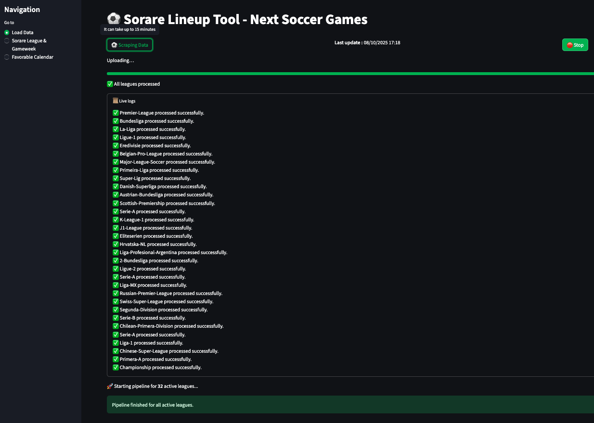
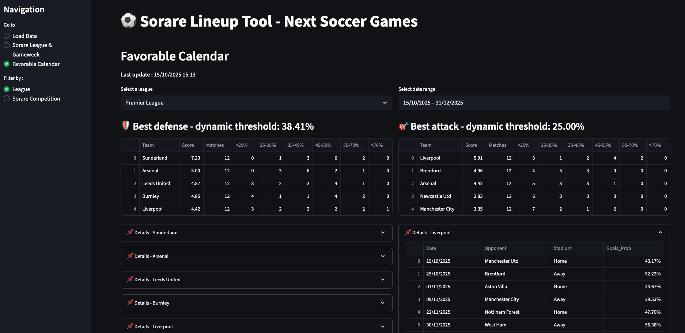

# ⚽ Next Soccer Games for Sorare Lineup Probability

This project is a data-driven assistant to help optimize Sorare fantasy football lineups. It uses advanced statistical models to estimate match outcome probabilities and presents the insights in a custom Streamlit web app.

---

## 🚀 Project Overview

The goal is to support Sorare managers in making better lineup decisions by modeling match expectations using real football data and statistical probability.

The app computes:

- Win probabilities
- Clean sheet chances
- 3+ goals scored probabilities
- Likely final scores

---

## 📊 Features

- ✅ **Scraping** key team stats (goals, xG, etc.) from FBref
- 🧹 **Cleaning and processing** seasonal stats
- 🧠 **Blending data** between current and previous seasons, with special handling for newly promoted teams
- 🔄 **Poisson model** to simulate scorelines and compute event probabilities
- 📆 **Automatic Gameweek generation** based on upcoming fixtures
- 🌍 **Multi-league support** (customizable)
- 🗂️ **Local CSV backups** for raw, processed, and exported data
- 🌐 **Streamlit dashboard** with 3 interactive views:
  - League-level analysis
  - Competition-level aggregation
  - Gameweek calendar with favorable matchups

---

## 🛠️ Tech Stack

- **Python**
- **Pandas** and **numpy** for data manipulation
- **Selenium** for web scraping
- **Streamlit** for UI
- **Poisson distribution** for probability modeling
- _(optional)_ Google Sheets API for external data export

---

## 📸 Screenshots





---

## 📁 Project Structure

```bash
nextsoccergames/
├── src/
│   ├── scraping/
│   ├── processing/
│   ├── pipeline/
│   └── dashboard/
├── data/
│   ├── raw/
│   ├── processed/
│   ├── analysis/
│   ├── team_stats/
│   ├── upcoming_matches/
│   └── exports/
├── .streamlit/
├── assets/
├── config/
├── env-nextsoccergames
├── app.py
├── .gitignore
├── requirements.txt
└── README.md
```

---

## ✅ How to Run

### 1. Clone the repo

```bash
git clone https://github.com/AntoinePro74/NextSoccerGames.git
cd nextsoccergames
```

### 2. Create and activate a virtual environment (optional but recommended)

```bash
python -m venv env
source env/bin/activate  # On Windows: env\Scripts\activate
```

### 3. Install dependencies

```bash
pip install -r requirements.txt
```

### 4. Launch the app

```bash
streamlit run app.py
```

---

## 📌 Possible Improvements

- Test other probability distributions (Negative Binomial, Skellam…)
- Integrate recent team form more finely
- Add injury/suspension information
- Build a Power BI report on top of exported datasets
- Extend dashboard with player-level stats

---

## 🙋 Author

**Antoine Bineau**  
_Data Analyst & Fantasy Football Enthusiast_  
[LinkedIn](https://www.linkedin.com/in/antoine-bineau/)

---

## 📝 License

MIT License

---

## 🤝 Contributions

Contributions, ideas, or feature suggestions are welcome! Open an issue or submit a PR.
